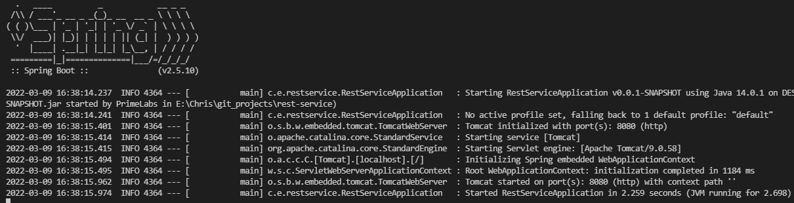

# Introduction to running Spring Boot Web App in Docker
If you are new to [Spring Boot](https://spring.io/) like I am, a useful start is to try one of the [tutorials](https://spring.io/guides) available on the Spring website. But what if you want to take it a step further? This repository contains what you need to understand how to start a Spring Boot [Restful](https://restfulapi.net/) web service and [containerise](https://www.docker.com/resources/what-container) it using Docker.

## Requirements
In order to complete this tutorial, you will need the following installed on your machine:
* [Java JDK](https://docs.oracle.com/en/java/javase/17/install/overview-jdk-installation.html#GUID-8677A77F-231A-40F7-98B9-1FD0B48C346A) for development (I used 13.0.2)
* [Maven](https://maven.apache.org/install.html) (feel free to use Gradle instead, though the build command and jar name will be different)
* [Docker](https://docs.docker.com/get-docker/)
    * [Docker compose](https://docs.docker.com/compose/install/) which comes standard with a Windows Docker installation
* Your favorite IDE will be useful, mine is [VS Code](https://code.visualstudio.com/docs/setup/setup-overview)

## Run
### In the cloud
If you'd like to get some experience running this containerised app in the cloud, take a look at my [other tutorial](https://github.com/koos-burgoyne/terraform_aws_web-app) on using [Terraform](https://terraform.io) to provision this app to [AWS cloud services](https://aws.amazon.com/).

### From the built project
If you want to jump-start without doing it manually as laid out below, then simply clone this repository and follow these steps:
* Open a terminal in the root directory of this project
* Run `./mvnw clean package` from the root directory will build a jar file containing the app
* Move the jar file from the `target/` directory to the `docker/` directory
    * Why? Docker does not support cross-directory ADDs
* Run `docker-compose up` from the `docker/directory` or `docker-compose -f ../docker/docker-compose.yml up -d` if you're in another directory
* open http://localhost:8080 in your web browser or use `curl http://localhost:8080`if you have [Windows Subsystem for Linux](https://docs.microsoft.com/en-us/windows/wsl/install) on your machine
* Take a look at the [source code](./src/main/java/com/example/restservice/RestServiceApplication.java) for this app - what endpoints are there to play with?
    * What happens if you greet the app too many times?

## Build-it-yourself
Follow these steps to complete this tutorial manually - it's a much better way to get to grips with the services involved in running a web-app of this nature. So instead of cloning this repository, just follow along below.

Head to the [Spring Initializr](https://start.spring.io/) to create a boiler plate for your project. This project is built with Maven, Java, the lastest stable Spring Boot, Jar packaging and Java 11. I gave the project a name: restservice. Add the following dependencies:
* Rest Repositories
* Thymeleaf
* JPA
* H2

Generate the project, save the zip file, and extract it. 

### Controller and Request Mapping Annotation:
Let's start by creating an index endpoint that returns information when the server is contacted. Because we are creating a Spring-based Restful web-app, we want to begin by creating both Index.java and IndexController.java files in the src/main/java/com/example/restservice directory. 

The resource controller is what handles the HTTP requests. Components are identified with the `@RestController` annotation, and the `@GetMapping()` annotation routes HTTP GET requests to the annotated method.

### Index Endpoint:
`Index.java` contains the classic Java class with local variables, constructor and functions. In this example, we want to return a value and string from the index endpoint:
```
package com.example.restservice;

public class Index {
    private final long id;
	private final String content;

	public Index(long id, String content) {
		this.id = id;
		this.content = content;
	}

	public long getId() {
		return id;
	}

	public String getContent() {
		return content;
	}
}
```
`IndexController.java` contains the resource controller that Spring uses to direct HTTP requests. In this case, when the client accesses the https://localhost:8080/ endpoint we will return a counter and a string that accepts a value if supplied:
```
package com.example.restservice;

import org.springframework.web.bind.annotation.GetMapping;
import org.springframework.web.bind.annotation.RestController;

import java.util.concurrent.atomic.AtomicLong;
import org.springframework.web.bind.annotation.RequestParam;

@RestController
public class IndexController {
    
    private static final String template = "Hello %s, this index endpoint has %d hits!";
	private final AtomicLong counter = new AtomicLong();

	@GetMapping("/")
	public Index index(@RequestParam(value = "name", defaultValue = "World") String name) {
        counter.incrementAndGet();
		return new Index(counter.get(), String.format(template, name, counter.get()));
	}
}
``` 
Because we are returning an object, the output is formatted in JSON using the [Jackson JSON library](https://github.com/FasterXML/jackson) which is automatically included in the Spring web starter dependency.

### Greeting Endpoint
Repeating this process, we create Greeting.java and GreetingController.java files. `Greeting.java` contains the class of which an object instance is returned:
```
package com.example.restservice;

public class Greeting {
    private final long id;
	private final String content;

	public Greeting(long id, String content) {
		this.id = id;
		this.content = content;
	}

	public long getId() {
		return id;
	}

	public String getContent() {
		return content;
	}
}
```
`GreetingController.java` contains the @RestController for the Greeting class. When you hit that https://localhost:8080/greeting endpoint, you should see a JSON formatted response.
```
package com.example.restservice;

import java.util.concurrent.atomic.AtomicLong;

import org.springframework.web.bind.annotation.GetMapping;
import org.springframework.web.bind.annotation.RequestParam;
import org.springframework.web.bind.annotation.RestController;

@RestController
public class GreetingController {

	private static final String template = "Greetings %s!";
	private final AtomicLong counter = new AtomicLong();

	@GetMapping("/greeting")
	public Greeting greeting(@RequestParam(value = "name", defaultValue = "world") String name) {
		if (counter.incrementAndGet() > 3)
			return new Greeting(counter.get(), "I think that's enough now...");
		else
			return new Greeting(counter.get(), String.format(template, name));
	}
}
```
Of course you can use the usual Java syntax to implement interesting features in your web-app. Looking at the `greeting` function below, what happens when the web-app is greeted too many times?

### Build
To build this project using maven, open a terminal and run `.mvnw clean package` from the root directory. This will create a .jar file in a new `target/` directory. If you'd like, you can run this jar file using the `java -jar target/<file-name>.jar` command. You should see something like this in the terminal:

<br>
You should now be able to access http://localhost:8080 and it will display
```
{"id":1,"content":"Hello World, this index page has 1 hits!"}
```
As you refresh the page, the counter increments using the `incrementAndGet()` function.

### Containerise
Create a `docker` directory and in it create a `Dockerfile` and `docker-compose.yml` file. Now copy the jar file to the docker folder.

In the Dockerfile, add the following:
* `FROM adoptopenjdk/openjdk11:alpine-jre` as the base image - this supports the build of this project (Java 11, or [55](https://en.wikipedia.org/wiki/Java_class_file#General_layout))
* `WORKDIR /` to set the working directory
* `ADD rest-service-0.0.1-SNAPSHOT.jar rest-service.jar` to add the jar file
* `EXPOSE 8080` to expose a container port
* `CMD java -jar rest-service.jar` run the jar file when starting the container

In the `docker-compose.yml` file:
* specify the version
* start a service called 'web' which is built from a dockerifle in the same directory
* map a local port to a port in the container:
```
version: "3.8"
services:
  web:
    build: .
    ports:
      - "8080:8080"
```

Now you can run `docker-compose up` when you're in the docker directory.
This builds the image  and spins up a container which you can see the details of by running `docker ps`. 

### Test the Service
You should now be able to access http://localhost:8080. Play with the endpoints by adding a `?name=<string>` and seeing what it returns. How is this achieved using [class objects](src/main/java/com/example/restservice/Index.java) and the [resource controllers](src/main/java/com/example/restservice/IndexController.java)?

### Stop the Service
This container can be stopped by executing `docker stop <container id>`.

## Well Done!
And that is it - congrats on reaching the end of this tutorial. If you want to practice more, try out some official [Spring guides](https://spring.io/guides). Thanks for stopping by!
